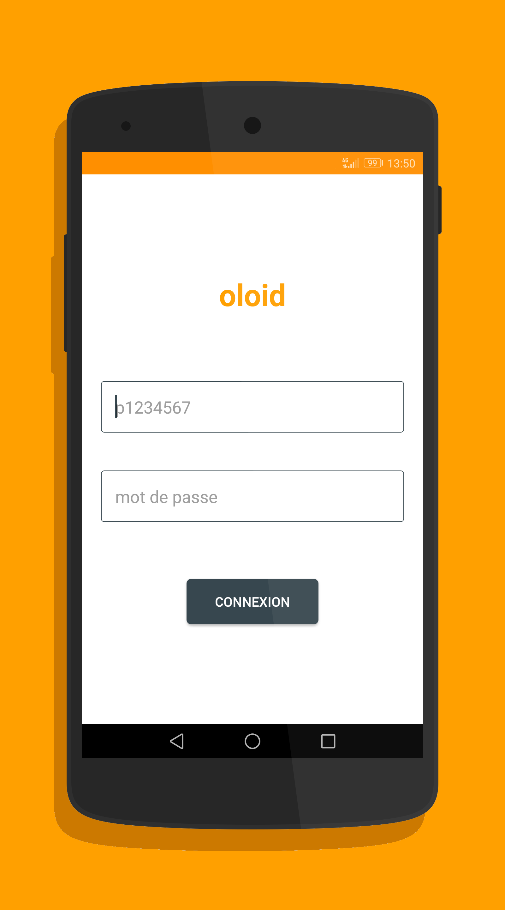
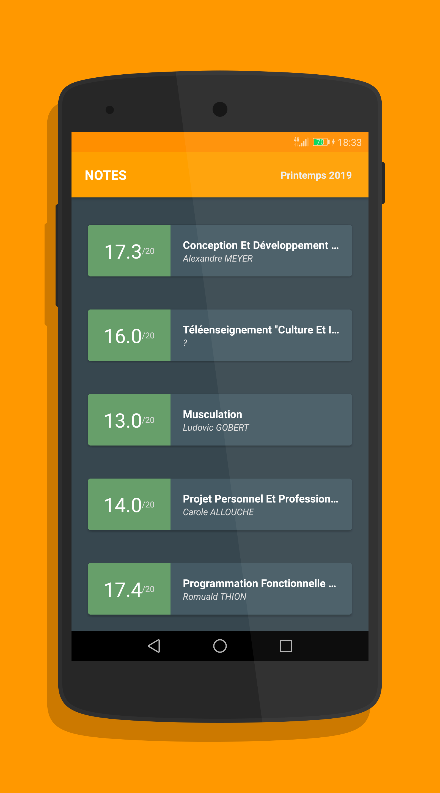
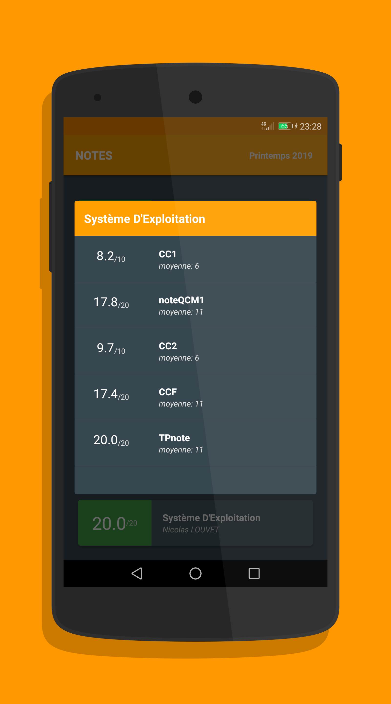
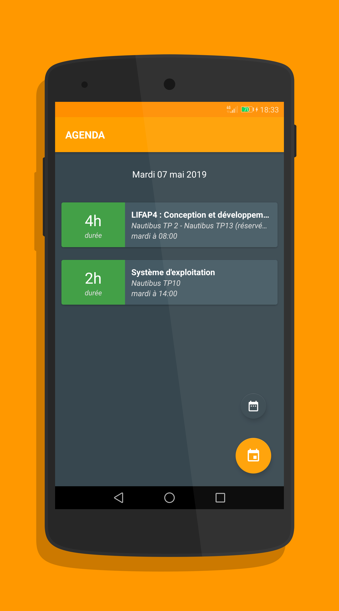

# Oloid
Oloid est une application pour les étudiants de Lyon 1. Elle permet d'accéder à ses notes, son emploi du temps, ses examens...

## Discord
Pour signaler un bug ou participer au développement, se rendre sur le Discord : <a href="https://discord.gg/zDhNMr4">lien d'invitation</a>.

## Téléchargement
Pour télécharger l'application, voir <a href="https://github.com/cl6ment/oloid-release/releases">cette page</a>.

## Screens

	   
	  

## Fonctionalitées
* connexion automatique
* accès aux notes
* accès aux absences justifiées
* accès aux examens
* accès au calendrier

